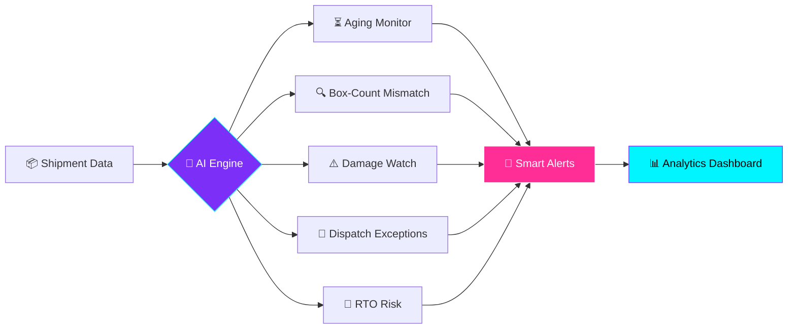
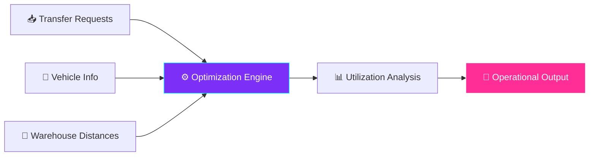
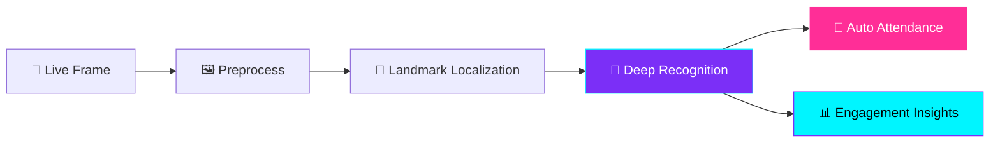
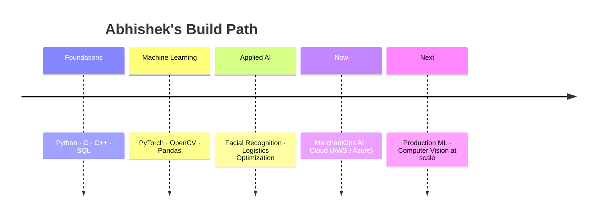

<div align="center">


<br/>

<a href="https://www.linkedin.com/in/abhishek-r-biradar"></a>
<a href="mailto:abhishekrbiradar908a@gmail.com"></a>
<a href="https://github.com/AbhishekRBiradar"></a>


</div>


<div align="center">

### `〔 SYSTEM STATUS 〕`

| 🟢 STATUS | 🎓 EDUCATION | 📈 CGPA | 🏆 LATEST WIN |
| :-: | :-: | :-: | :-: |
| **Open to Work** | **B.E. AI & ML · VVIT** | **8.1 / 10** | **🥈 VTU Hackathon 2026** |

</div>


## 🧬 `> whoami`

```ts
const abhishek = {
  role:      "AI/ML Developer",
  degree:    "B.E. Artificial Intelligence & Machine Learning (2023–2027)",
  superpower:["Computer Vision", "Deep Learning", "Logistics AI", "Data Analytics"],
  cloud:     ["AWS", "Microsoft Azure"],
  mission:   "Build useful AI systems that solve real operational problems",
  lookingFor:["Internships", "Collaborations", "Hackathon teams"],
} as const;
```

---

## 🚀 `> ls ./projects`

<div align="center">

### 🚚 MerchantOps AI
**Intelligent Logistics Operations Platform**

*Catches shipment and dispatch issues before they hit delivery performance.*




<br/>

### 🚛 LOGICOMMERCE AI V5
**AI-Powered Vehicle Utilization Optimizer**

*Transfer requests + vehicle data + warehouse distances → smarter allocation, less manual planning.*




<br/>

### 👁️ Automated Facial Recognition System
**Deep Learning • Computer Vision**

*End-to-end identity verification for automated attendance and classroom engagement monitoring.*




</div>

---

## 🛠️ `> cat ./stack.json`

<div align="center">


<br/><br/>

| Layer | Arsenal |
| :-- | :-- |
| 🧑‍💻 **Languages** | `Python` `C` `C++` `SQL` |
| 🤖 **AI / ML** | `PyTorch` `OpenCV` `Machine Learning` `Computer Vision` |
| 📊 **Data** | `Pandas` `OpenPyXL` `Power BI` |
| 🌐 **Web** | `React.js` `Tailwind CSS` `HTML5` `CSS3` |
| ☁️ **Cloud** | `AWS` `Microsoft Azure` |
| 🧰 **Tools** | `Git` `GitHub` `VS Code` |

</div>

---

## 📡 `> git stats --live`

<div align="center">


<br/>

<!-- 🐍 Snake animation: requires the snake.yml workflow (see setup notes) -->
<picture>
  <source media="(prefers-color-scheme: dark)" srcset="https://raw.githubusercontent.com/AbhishekRBiradar/AbhishekRBiradar/output/github-snake-dark.svg" />
  <source media="(prefers-color-scheme: light)" srcset="https://raw.githubusercontent.com/AbhishekRBiradar/AbhishekRBiradar/output/github-snake.svg" />
  
</picture>

</div>

---

## 🏆 `> achievements --unlocked`

<div align="center">

| | Achievement | Location | Year |
| :-: | :-- | :-- | :-: |
| 🥈 | **VTU State-Level Hackathon — 2nd Place Winner** | Chikkaballapur | `2026` |
| 🌐 | **Bengaluru Tech Summit — Business Delegate** | Bengaluru | `2025` |
| 🚀 | **Startup Mahakumbh — Future Entrepreneur** | Pragati Maidan, New Delhi | `2025` |

</div>

<details>
<summary><b>📜 Certifications</b></summary>
<br/>

**Technical Certifications Suite — Infosys Springboard**
Modern programming practices, logical problem-solving and foundational engineering principles.

</details>

---

## 🎯 `> roadmap`



---

<div align="center">

### 💬 Let's build something

*Open to collaborations, internships and hackathon teams working on AI, vision or logistics problems.*

<a href="mailto:abhishekrbiradar908a@gmail.com"></a>
<a href="https://www.linkedin.com/in/abhishek-r-biradar"></a>

<br/>

`🚀 Building • Learning • Experimenting • Improving`


</div>
