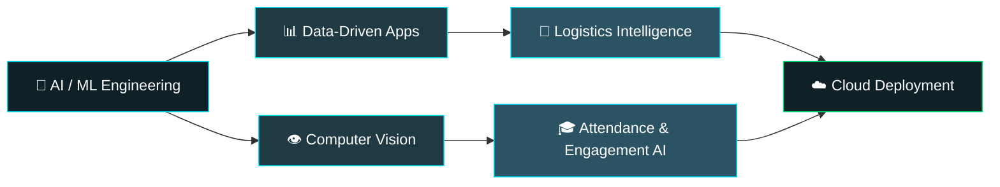
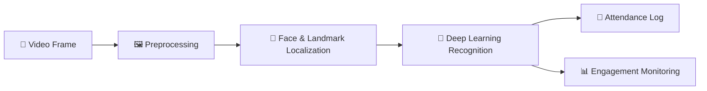

<!-- ===================== HEADER ===================== -->
<div align="center">


<br/>

<a href="https://github.com/AbhishekRBiradar"></a>
<a href="https://www.linkedin.com/in/abhishek-r-biradar"></a>
<a href="mailto:abhishekrbiradar908a@gmail.com"></a>

<br/><br/>


</div>

---

## ⚡ `whoami`

```bash
$ whoami
abhishek-r-biradar

$ cat profile.json
{
  "role"      : "AI/ML Developer",
  "education" : "B.E. AI & ML — VVIT, Bengaluru (2023–2027)",
  "focus"     : ["Computer Vision", "Deep Learning", "Logistics AI", "Data Analytics"],
  "cloud"     : ["AWS", "Microsoft Azure"],
  "mission"   : "Build useful AI systems that solve real operational problems",
  "status"    : "🟢 Open to internships, collaborations & hackathons"
}
```

---

## 🧭 Focus Map



---

## 🚀 Featured Projects

<table>
<tr>
<td width="50%" valign="top">

### 🚚 MerchantOps AI
**Intelligent Logistics Operations Platform**

Catches shipment and dispatch problems *before* they hurt delivery performance.

- 📦 Shipment aging monitoring
- 🔍 Box-count mismatch detection
- ⚠️ Damaged shipment monitoring
- 🚚 Dispatch exception detection
- 🔄 RTO risk analysis
- 🔔 Intelligent operational alerts
- 📊 Shipment & delivery analytics


</td>
<td width="50%" valign="top">

### 🚛 LOGICOMMERCE AI V5
**Vehicle Utilization Optimizer**

Processes transfer requests, vehicle data and warehouse distances to support smarter vehicle allocation.

- 🚚 Vehicle utilization analysis
- 📍 Warehouse-distance processing
- 📦 Transfer request processing
- ⚙️ Automated logistics analysis
- 📊 Operational output generation
- ⏱️ Less manual planning effort


</td>
</tr>
<tr>
<td colspan="2" valign="top">

### 👁️ Automated Facial Recognition System
**Deep Learning • Computer Vision**

End-to-end identity verification and automated attendance, with classroom engagement monitoring.




</td>
</tr>
</table>

---

## 🧠 Tech Stack

<div align="center">


<br/><br/>

| Domain | Tools |
| :-- | :-- |
| 🧑‍💻 **Languages** | Python · C · C++ · SQL |
| 🤖 **AI / ML** | PyTorch · OpenCV · Machine Learning · Computer Vision |
| 📊 **Data** | Pandas · OpenPyXL · Power BI |
| 🌐 **Web** | React.js · Tailwind CSS · HTML5 · CSS3 |
| ☁️ **Cloud** | AWS · Microsoft Azure |
| 🛠️ **Workflow** | Git · GitHub · VS Code |

</div>

---

## 📊 GitHub Analytics

<div align="center">


</div>

---

## 🏆 Achievements

| | Achievement | Where | When |
| :-: | :-- | :-- | :-: |
| 🥈 | **VTU State-Level Hackathon — 2nd Place** | Chikkaballapur | 2026 |
| 🌐 | **Bengaluru Tech Summit — Business Delegate** | Bengaluru | 2025 |
| 🚀 | **Startup Mahakumbh — Future Entrepreneur** | Pragati Maidan, New Delhi | 2025 |

<details>
<summary><b>📜 Certifications</b></summary>
<br/>

**Technical Certifications Suite — Infosys Springboard**
Modern programming practices, logical problem-solving and foundational engineering principles.

</details>

<details>
<summary><b>🎓 Education</b></summary>
<br/>

**B.E. — Artificial Intelligence & Machine Learning**
Vijaya Vittala Institute of Technology (VVIT), Bengaluru
2023 – 2027 · CGPA **8.1 / 10**

</details>

---

## 🎯 Currently Building

```python
class Abhishek:
    role = "AI/ML Developer"

    building = [
        "AI-powered logistics solutions",
        "Computer vision applications",
        "Data-driven automation systems",
    ]

    learning = ["Cloud architecture", "Deep learning", "Production ML"]

    def goal(self):
        return "Build useful AI systems that solve real-world problems"
```

---

## 🤝 Let's Connect

<div align="center">

Open to **collaborations, internships and hackathon teams**. If you're working on AI, vision or logistics problems, say hi.

<a href="mailto:abhishekrbiradar908a@gmail.com"></a>
<a href="https://www.linkedin.com/in/abhishek-r-biradar"></a>
<a href="https://github.com/AbhishekRBiradar"></a>

<br/>

**🚀 Building • Learning • Experimenting • Improving**


</div>
